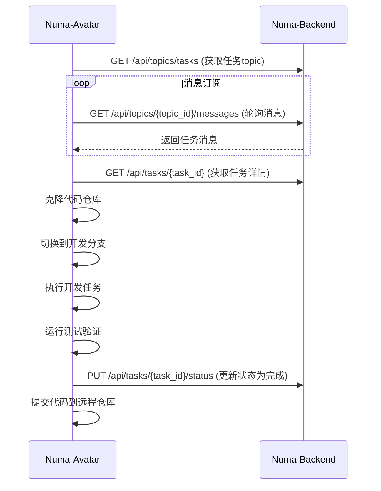
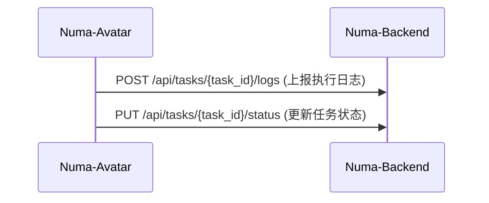

# Numa Avatar

Numa Avatar 是一个分布式的开发任务执行器，部署在用户环境中，通过订阅机制接收任务并执行完整的开发流程。

## 功能特性

1. **任务订阅**：通过消息topic订阅机制接收开发任务
2. **Git操作**：支持多种Git服务(GitHub, GitLab等)的代码操作
3. **开发执行**：根据开发方案执行具体开发任务
4. **测试验证**：运行项目测试验证开发结果
5. **状态汇报**：通过Web API向后端汇报任务执行状态

## 目录结构

```
numa_avatar/
├── main.py                 # 入口文件
├── config.py               # 配置管理
├── avatar.py               # Avatar主类
├── services/
│   ├── git_service.py      # Git操作服务
│   ├── task_service.py     # 任务执行服务
│   ├── api_service.py      # API服务（与后端通信）
│   └── message_service.py  # 消息订阅服务
├── models/
│   ├── task.py             # 任务模型
│   └── application.py      # 应用模型
├── utils/
│   ├── logger.py           # 日志工具
│   └── executor.py         # 命令执行工具
└── requirements.txt        # 依赖文件
```

## 配置文件

```yaml
# config.yaml
backend:
  url: "http://localhost:7301"
  api_token: "your_api_token"

git:
  username: "your_git_username"
  email: "your_email@example.com"
  
avatar:
  id: "avatar_001"
  name: "Developer Avatar"
  
polling:
  interval: 5  # 轮询间隔（秒）
```

## 通信机制

1. **任务接收**：通过消息topic订阅机制接收任务推送
2. **状态上报**：通过Web API主动上报执行状态
3. **信息获取**：通过Web API获取任务详情、更新任务状态

## API接口

### 后端API接口（Numa-Backend提供）

```
# 消息订阅相关
GET /api/topics/tasks - 获取任务消息topic
GET /api/topics/{topic_id}/messages - 从topic获取消息

# 任务相关
GET /api/tasks/{task_id} - 获取任务详情
PUT /api/tasks/{task_id}/status - 更新任务状态
POST /api/tasks/{task_id}/logs - 上报执行日志

# Git相关
GET /api/applications/{app_id} - 获取应用信息（包含Git仓库地址）
```

## 交互流程

### 任务执行流程



### 状态上报流程

