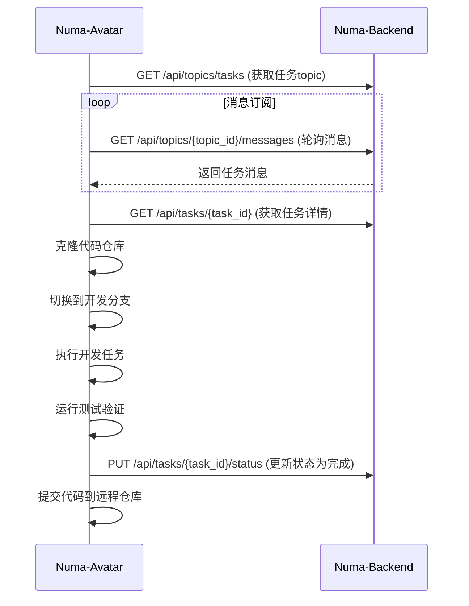
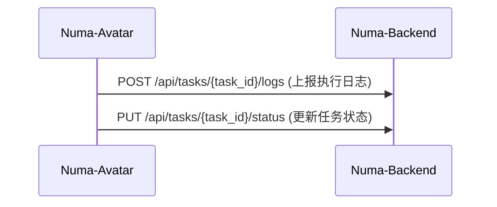

# Numa Avatar 设计方案

## 组件定位

`numa-avatar`是分布式的开发任务执行器，部署在用户环境中，通过订阅机制接收任务并执行完整的开发流程。

## 通信机制

1. **任务接收**：通过消息topic订阅机制接收任务推送
2. **状态上报**：通过Web API主动上报执行状态
3. **信息获取**：通过Web API获取任务详情、更新任务状态

## API接口设计

### 后端API接口（Numa-Backend提供）

```
# 消息订阅相关
GET /api/topics/tasks - 获取任务消息topic
GET /api/topics/{topic_id}/messages - 从topic获取消息

# 任务相关
GET /api/tasks/{task_id} - 获取任务详情
PUT /api/tasks/{task_id}/status - 更新任务状态
POST /api/tasks/{task_id}/logs - 上报执行日志

# Git相关
GET /api/applications/{app_id} - 获取应用信息（包含Git仓库地址）
```

### Avatar内部接口

```
# Avatar状态管理
GET /status - 获取Avatar运行状态
POST /config - 更新配置信息
```

## 交互流程设计

### 任务执行流程



### 状态上报流程



## 核心功能模块

### 消息订阅模块

- 连接到Numa-Backend，订阅任务topic
- 处理任务分发和状态更新

### 任务执行模块

- 解析任务详情
- 协调各子模块完成任务

### Git操作模块

- 支持多种Git服务(GitHub, GitLab等)
- 实现代码拉取、分支切换、代码提交等功能

### 开发执行模块

- 根据开发方案执行具体开发任务
- 可能需要集成LLM进行代码生成和修改

### 测试验证模块

- 运行项目测试
- 验证开发结果

### 状态汇报模块

- 向Numa-Backend汇报任务执行状态和日志

## 技术实现方案

### 消息通信

使用HTTP长轮询实现消息topic订阅

### Git操作

使用Python的subprocess模块调用系统Git命令

### HTTP客户端

使用httpx库与后端API交互

### 部署方式

- 提供Docker镜像便于部署
- 支持配置文件定制

## 目录结构

```
numa_avatar/
├── main.py                 # 入口文件
├── config.py               # 配置管理
├── avatar.py               # Avatar主类
├── services/
│   ├── git_service.py      # Git操作服务
│   ├── task_service.py     # 任务执行服务
│   ├── api_service.py      # API服务（与后端通信）
│   └── message_service.py  # 消息订阅服务
├── models/
│   ├── task.py             # 任务模型
│   └── application.py      # 应用模型
├── utils/
│   ├── logger.py           # 日志工具
│   └── executor.py         # 命令执行工具
└── requirements.txt        # 依赖文件
```

## 配置文件设计

```yaml
# config.yaml
backend:
  url: "http://localhost:7301"
  api_token: "your_api_token"

git:
  username: "your_git_username"
  email: "your_email@example.com"
  
avatar:
  id: "avatar_001"
  name: "Developer Avatar"
  
polling:
  interval: 5  # 轮询间隔（秒）
```

## 关键技术挑战及解决方案

### 1. 任务理解准确性

**挑战**：确保正确理解自然语言描述的任务需求。

**解决方案**：
1. **多轮澄清机制**：
   ```python
   class TaskClarifier:
       def clarify_task(self, initial_description: str) -> str:
           """
           通过多轮对话澄清任务需求
           """
           # 发送初始描述给LLM
           # 分析LLM返回的问题
           # 与后端或用户交互获取答案
           # 重新构建清晰的任务描述
           pass
   ```

2. **结构化任务描述**：
   ```python
   class TaskStructure:
       def __init__(self):
           self.functional_requirements = []
           self.technical_requirements = []
           self.acceptance_criteria = []
           self.affected_files = []
           self.dependencies = []
   ```

3. **示例引导**：
   - 提供项目中类似任务的成功案例作为参考
   - 使用few-shot learning提高理解准确性

### 2. 代码质量保证

**挑战**：生成的代码需要符合项目规范，无语法错误。

**解决方案**：
1. **分阶段验证**：
   ```python
   class CodeQualityChecker:
       def check_syntax(self, code: str, language: str) -> bool:
           """语法检查"""
           pass
       
       def check_style(self, code: str, project_context: ProjectContext) -> bool:
           """代码风格检查"""
           pass
       
       def check_security(self, code: str) -> bool:
           """安全检查"""
           # 检查潜在的安全漏洞
           # 如SQL注入、XSS等
           pass
   ```

2. **项目规范学习**：
   ```python
   class ProjectStandards:
       def learn_from_project(self, project_path: str):
           """从项目中学习编码规范"""
           # 分析.eslintrc, .pylintrc等配置文件
           # 学习现有代码的风格
           pass
   ```

3. **模板驱动开发**：
   - 使用项目中已有的代码模板
   - 确保新代码与现有代码风格一致

### 3. 上下文感知

**挑战**：理解项目现有结构和编码风格。

**解决方案**：
1. **项目分析**：
   ```python
   class ProjectAnalyzer:
       def analyze_structure(self, project_path: str) -> ProjectStructure:
           """分析项目结构"""
           # 识别主要目录和文件类型
           # 理解模块组织方式
           pass
       
       def analyze_dependencies(self, project_path: str) -> Dependencies:
           """分析项目依赖"""
           # 解析package.json, requirements.txt等
           pass
       
       def analyze_patterns(self, project_path: str) -> CodingPatterns:
           """分析编码模式"""
           # 识别常用的设计模式和架构
           pass
   ```

2. **增量学习**：
   - 持续学习项目中新出现的模式
   - 建立项目知识库

### 4. 错误处理

**挑战**：处理生成失败或测试失败的情况。

**解决方案**：
1. **分级错误处理**：
   ```python
   class ErrorHandling:
       def handle_generation_error(self, error: Exception, context: str) -> bool:
           """处理代码生成错误"""
           # 记录错误日志
           # 尝试修复策略
           # 必要时请求人工干预
           pass
       
       def handle_test_failure(self, test_output: str) -> bool:
           """处理测试失败"""
           # 分析失败原因
           # 尝试自动修复
           # 生成修复建议
           pass
   ```

2. **回滚机制**：
   ```python
   class CodeRollback:
       def create_snapshot(self, project_path: str):
           """创建代码快照"""
           # 在修改前创建Git提交或备份
           pass
       
       def rollback_changes(self, project_path: str):
           """回滚变更"""
           # 恢复到修改前的状态
           pass
   ```

3. **重试机制**：
   - 对于可恢复的错误，实施重试策略
   - 限制重试次数防止无限循环

### 5. 安全性

**挑战**：防止生成恶意代码或执行危险操作。

**解决方案**：
1. **代码审查**：
   ```python
   class SecurityChecker:
       def check_dangerous_patterns(self, code: str) -> List[str]:
           """检查危险模式"""
           # 检查系统调用
           # 检查文件操作
           # 检查网络请求
           pass
       
       def check_privilege_escalation(self, code: str) -> bool:
           """检查权限提升风险"""
           pass
   ```

2. **沙箱执行**：
   ```python
   class SandboxExecutor:
       def execute_in_sandbox(self, code: str, test_cases: List[str]) -> TestResult:
           """在沙箱中执行代码测试"""
           # 使用容器或虚拟机隔离执行环境
           # 限制资源使用
           # 监控执行行为
           pass
   ```

3. **权限控制**：
   - 限制Avatar对文件系统的访问权限
   - 使用配置文件定义允许的操作范围

### 6. 性能优化

**挑战**：提高代码生成和执行效率。

**解决方案**：
1. **缓存机制**：
   ```python
   class CodeCache:
       def get_cached_code(self, task_hash: str) -> Optional[str]:
           """获取缓存的代码"""
           pass
       
       def cache_code(self, task_hash: str, code: str):
           """缓存生成的代码"""
           pass
   ```

2. **并行处理**：
   - 对于独立的子任务，使用并行处理
   - 合理分配系统资源

3. **增量生成**：
   - 只重新生成变更部分
   - 复用未变更的代码