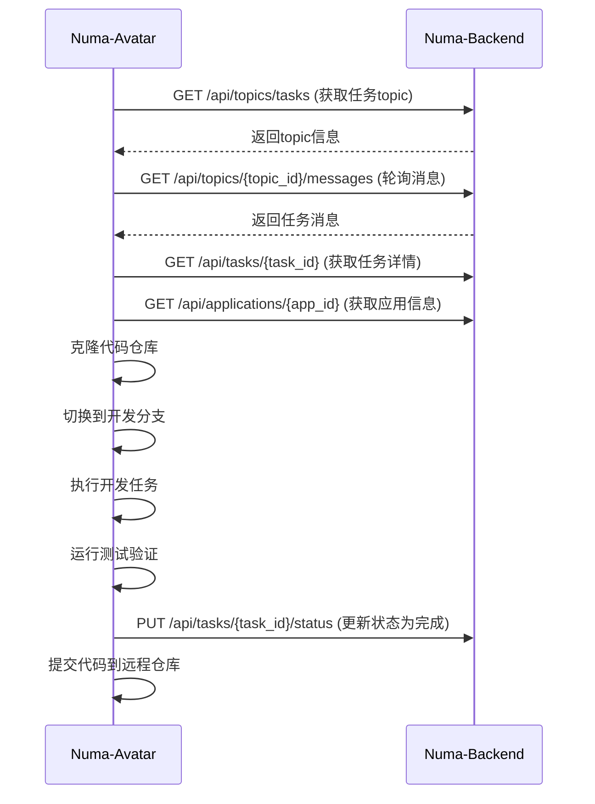
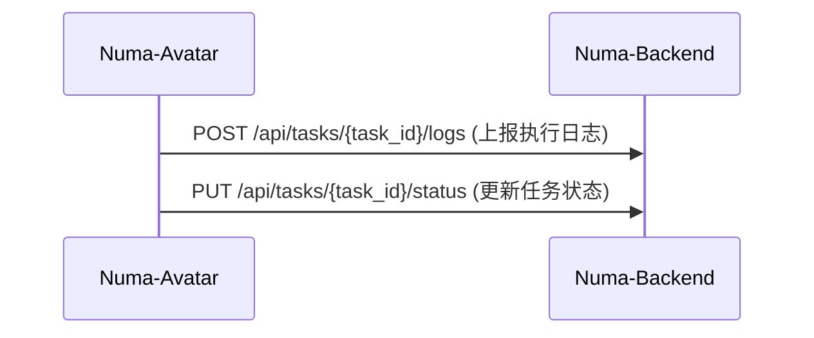

# Numa Avatar 交互流程文档

## 概述

本文档详细描述了 Numa Avatar 与 Numa Backend 之间的交互流程。

## 任务执行流程

## 状态上报流程

## 详细交互步骤

### 1. 订阅任务

1. Avatar 启动后，首先调用 `GET /api/topics/tasks` 获取任务topic
2. 保存topic ID用于后续轮询

### 2. 轮询消息

1. Avatar 定期调用 `GET /api/topics/{topic_id}/messages` 轮询新消息
2. 如果有新消息，解析消息中的任务ID

### 3. 获取任务详情

1. 收到任务ID后，调用 `GET /api/tasks/{task_id}` 获取任务详情
2. 调用 `GET /api/applications/{app_id}` 获取应用信息

### 4. 执行开发任务

1. 克隆代码仓库到临时目录
2. 切换到指定的开发分支
3. 根据任务描述执行开发工作
4. 运行项目测试验证变更
5. 提交代码并推送到远程仓库

### 5. 上报执行结果

1. 在执行过程中，定期调用 `POST /api/tasks/{task_id}/logs` 上报执行日志
2. 任务完成后，调用 `PUT /api/tasks/{task_id}/status` 更新任务状态为"done"

## 错误处理

1. 如果任何API调用失败，Avatar会记录错误日志并重试
2. 如果Git操作失败，Avatar会清理临时文件并上报失败状态
3. 如果任务执行失败，Avatar会更新任务状态为"failed"并提供错误信息